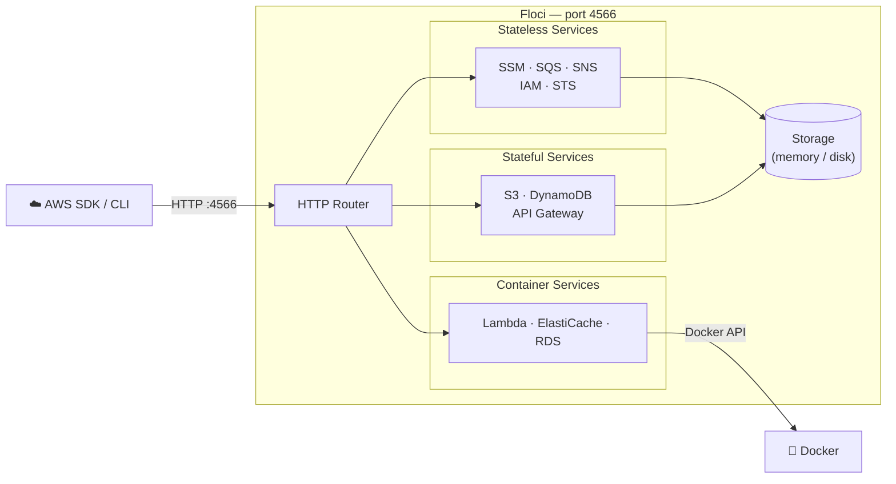
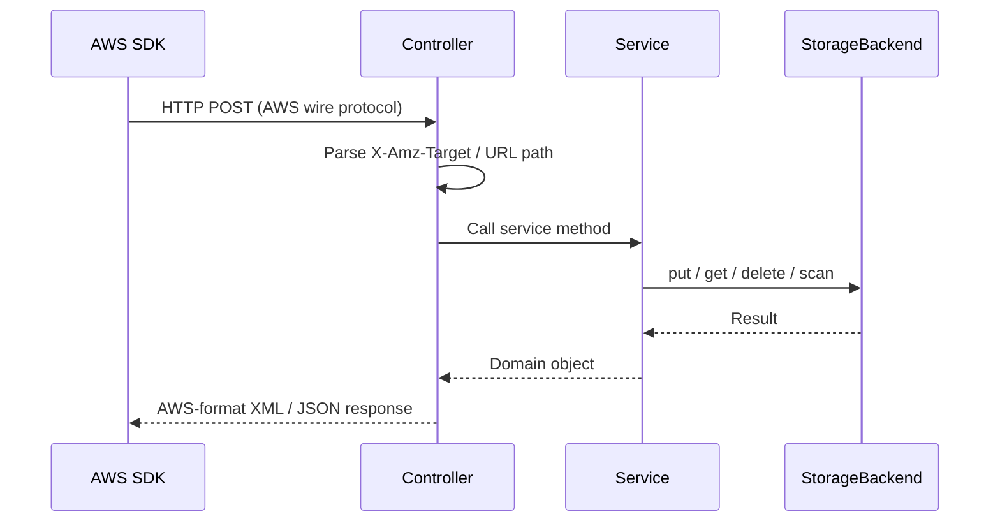
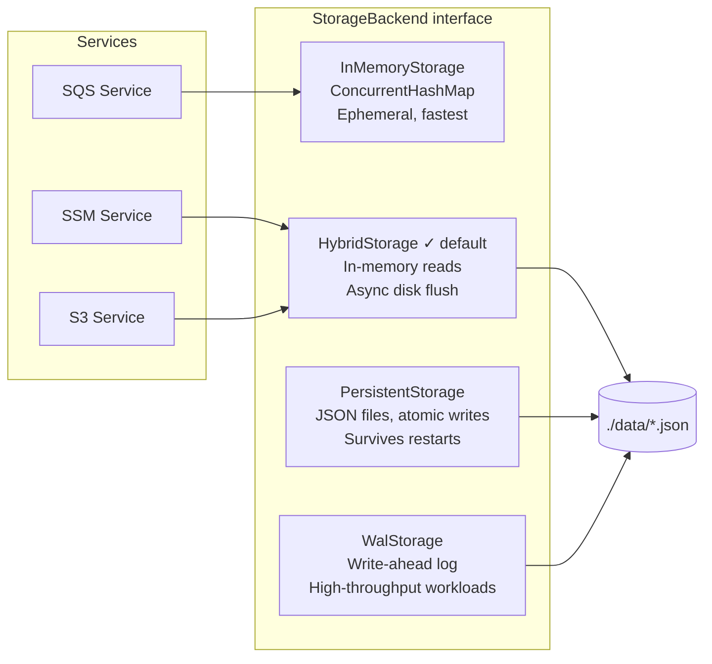
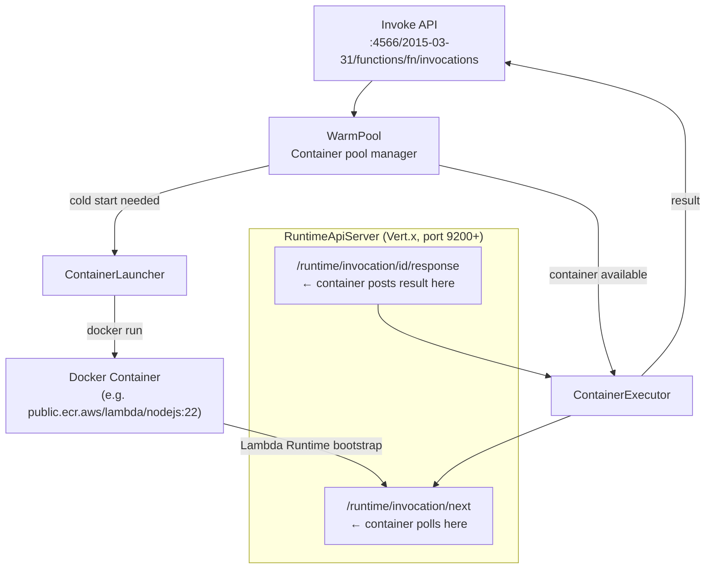
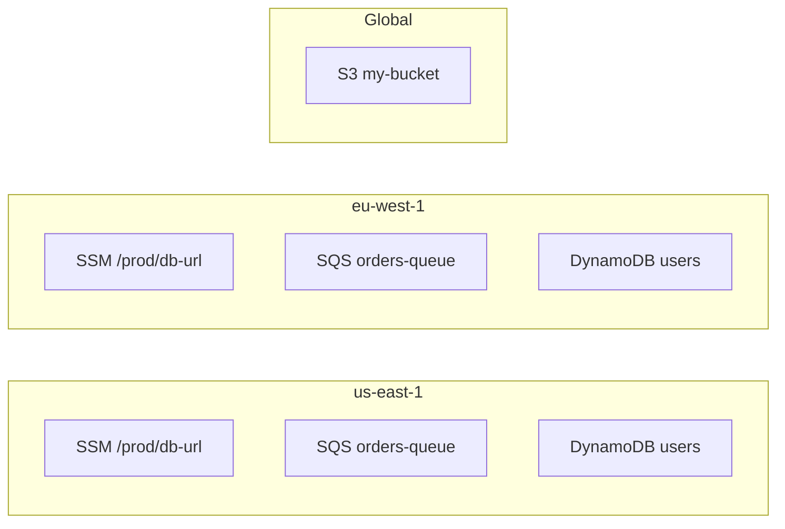

Local development against AWS services has always been painful. You either run real AWS (expensive,
slow, requires an internet connection) or use an emulator. For years, **LocalStack** was the
go-to choice — until they required auth tokens and locked down their community edition in early 2026.

That gap is exactly what **Floci** fills.

## Key Numbers: Native Floci vs LocalStack

| Metric | Native Floci | LocalStack | Advantage |
|---|---|---|---|
| **Startup Time** | **~24 ms** | ~3,300 ms | **138× faster** |
| **Idle Memory** | **~13 MiB** | ~143 MiB | **91% less** |
| **Lambda Latency** | **2 ms avg** | 10 ms avg | **5× faster** |
| **Lambda Throughput** | **289 req/s** | 120 req/s | **2.4× faster** |
| **Price** | **Free Forever** | Auth Token Req. | **$0 / No Auth** |

## What Is Floci?

**Floci** is a free, open-source local AWS service emulator written in Java using
[Quarkus](https://quarkus.io/) and compiled to a native binary via GraalVM Mandrel. It runs as a
single process on port `4566` — the same port LocalStack uses — so switching requires zero changes
to your existing code or tooling.

The name comes from *cirrocumulus floccus* (abbreviated *floci*), a cloud formation that looks like
popcorn — small, fluffy, and lightweight. That ethos drives the entire design: minimal footprint,
fast startup, and no unnecessary overhead.

```
Startup time:  24 ms  (native) / 684 ms (JVM)
Idle memory:   13 MiB (native) / 78 MiB (JVM)
License:       MIT
Auth required: Never
```

---

## Architecture Overview

Floci follows a clean three-layer architecture for every AWS service it emulates:



### Request Flow

Every AWS request goes through the same pipeline:



---

## Supported AWS Services

Floci covers 22 AWS service families out of the box:

| Service | Operations | Notable Features |
|---|---|---|
| **SSM Parameter Store** | 12 | PutParameter, GetParametersByPath, version history, labels, tagging |
| **SQS** | 17 | Standard & FIFO, DLQ, visibility timeout, batch operations, tagging |
| **SNS** | 13 | Topics, subscriptions, SQS/Lambda/HTTP delivery, tagging |
| **S3** | 30 | Versioning, multipart upload, pre-signed URLs, Object Lock, event notifications |
| **DynamoDB** | 22 | GSI/LSI, Query, Scan, TTL, transactions, batch operations |
| **DynamoDB Streams** | 5 | Shard iterators, records, Lambda ESM trigger |
| **Lambda** | 25 | Docker execution, warm pool, aliases, Function URLs, SQS/Kinesis/DynamoDB Streams ESM |
| **API Gateway REST** | 24 | Resources, methods, stages, Lambda proxy, MOCK integrations |
| **API Gateway v2** | 16 | HTTP APIs, routes, integrations, JWT authorizers, stages |
| **IAM** | 65+ | Users, roles, groups, policies, inline policies, instance profiles, access keys |
| **STS** | 7 | AssumeRole, WebIdentity, SAML, GetFederationToken, GetSessionToken |
| **Cognito** | 20 | User pools, app clients, auth flows, JWKS/OpenID well-known endpoints |
| **KMS** | 15 | Encrypt/decrypt, sign/verify, data keys, aliases |
| **Kinesis** | 15 | Streams, shards, enhanced fan-out, split/merge |
| **Secrets Manager** | 10 | Versioning, resource policies, tagging |
| **CloudFormation** | 12 | Stacks, change sets, resource provisioning |
| **Step Functions** | 11 | ASL execution, task tokens, execution history |
| **ElastiCache** | 9 | Redis via Docker, IAM auth, SigV4 validation |
| **RDS** | 14 | PostgreSQL & MySQL via Docker, IAM auth, JDBC |
| **EventBridge** | 14 | Custom buses, rules, targets (SQS/SNS/Lambda) |
| **CloudWatch Logs** | 14 | Log groups, streams, ingestion, filtering |
| **CloudWatch Metrics** | 5 | Custom metrics, statistics, alarms |

---

## Storage Architecture

One of Floci's most flexible design decisions is its pluggable storage layer. Every service gets its
own backend, and backends are configurable per service.



The default **HybridStorage** gives you the best of both worlds: in-memory read speed with
background persistence so your data survives container restarts.

---

## Lambda Execution Architecture

Lambda is the most complex service in Floci. Functions run inside **real Docker containers**, not
a JavaScript VM or mock interpreter. This means your Node.js, Python, Java, Go, or Ruby functions
run exactly as they would in production.



When an invocation arrives:

1. The **WarmPool** checks if a pre-warmed container exists for the function
2. If not, **ContainerLauncher** pulls the runtime image and starts a container
3. The container's Lambda bootstrap polls `/runtime/invocation/next` on the embedded **RuntimeApiServer**
4. The invocation payload is delivered, the function executes, and the result is posted back
5. The container is returned to the warm pool for reuse

---

## Floci vs LocalStack

### Feature Comparison

| Feature | Floci | LocalStack Community |
|---|---|---|
| **Price** | Free forever | Requires auth token (since March 2026) |
| **CI/CD usage** | Unlimited | Requires paid plan |
| **License** | MIT | Restricted / proprietary |
| **Auth token required** | Never | Yes |
| **Security updates** | Yes | Frozen for community tier |
| **Native binary** | Yes (~90 MB) | No |
| **Docker image size** | ~90 MB | ~1.0 GB |
| **Docker required for Lambda** | Yes | Yes |
| **SSM Parameter Store** | ✅ Full | ✅ Full |
| **SQS** | ✅ Full | ✅ Full |
| **SNS** | ✅ Full | ✅ Full |
| **S3** | ✅ Full (incl. Object Lock) | ⚠️ Object Lock partial |
| **DynamoDB** | ✅ Full (incl. Streams) | ⚠️ Streams partial |
| **Lambda** | ✅ Full | ✅ Full |
| **Lambda ESM (SQS, Kinesis, DDB Streams)** | ✅ | ⚠️ Partial |
| **API Gateway REST** | ✅ Full | ⚠️ Partial |
| **API Gateway v2 / HTTP API** | ✅ | ❌ Not available |
| **IAM** | ✅ Full (65+ ops) | ⚠️ Partial |
| **STS** | ✅ Full (7 ops) | ⚠️ 3 of 7 operations missing |
| **Cognito** | ✅ Full | ❌ Not available |
| **KMS** | ✅ Full | ⚠️ ReEncrypt, Sign/Verify missing |
| **Kinesis** | ✅ Full | ⚠️ PutRecord/GetRecords and EFO broken |
| **Secrets Manager** | ✅ Full | ⚠️ RotateSecret missing |
| **CloudFormation** | ✅ Full | ⚠️ Basic only |
| **Step Functions** | ✅ Full | ⚠️ Partial |
| **ElastiCache** | ✅ Docker-native + IAM auth | ❌ Not available |
| **RDS** | ✅ Docker-native + IAM auth | ❌ Not available |
| **EventBridge** | ✅ Full | ⚠️ Partial |
| **CloudWatch Logs** | ✅ Full | ⚠️ Tagging and FilterLogEvents missing |
| **CloudWatch Metrics** | ✅ Full | ✅ Full |
| **S3 Event Notifications** | ✅ | ❌ SNS subscription fails |

### AWS SDK Compatibility Test Results

Floci was benchmarked against LocalStack 4.14.0 using a suite of 408 AWS SDK v2 checks:

| Test Suite | Checks | Floci | LocalStack |
|---|---|---|---|
| SQS | 22 | ✅ 22/22 | ✅ 22/22 |
| SQS → Lambda ESM | 12 | ✅ 12/12 | ⚠️ 10/12 |
| SNS | 12 | ✅ 12/12 | ✅ 12/12 |
| S3 | 23 | ✅ 23/23 | ⚠️ 22/23 |
| S3 Object Lock | 30 | ✅ 30/30 | ⚠️ 24/30 |
| S3 Advanced | 13 | ✅ 13/13 | ⚠️ 10/13 |
| SSM | 12 | ✅ 12/12 | ✅ 12/12 |
| DynamoDB | 18 | ✅ 18/18 | ✅ 18/18 |
| DynamoDB Advanced | 18 | ✅ 18/18 | ⚠️ 16/18 |
| DynamoDB LSI | 4 | ✅ 4/4 | ✅ 4/4 |
| DynamoDB Streams | 12 | ✅ 12/12 | ⚠️ 8/12 |
| Lambda CRUD | 10 | ✅ 10/10 | ✅ 10/10 |
| Lambda Invoke | 4 | ✅ 4/4 | ✅ 4/4 |
| Lambda HTTP | 8 | ✅ 8/8 | ✅ 8/8 |
| Lambda Warm Pool | 3 | ✅ 3/3 | ✅ 3/3 |
| Lambda Concurrent | 3 | ✅ 3/3 | ✅ 3/3 |
| API Gateway REST | 43 | ✅ 43/43 | ⚠️ 42/43 |
| API Gateway v2 / HTTP API | 5 | ✅ 5/5 | ❌ 0/5 — not in community |
| S3 Event Notifications | 11 | ✅ 11/11 | ❌ 0/11 — SNS subscription fails |
| IAM | 32 | ✅ 32/32 | ⚠️ 27/32 |
| STS | 18 | ✅ 18/18 | ⚠️ 6/18 |
| IAM Performance | 3 | ✅ 3/3 | ✅ 3/3 |
| EventBridge | 14 | ✅ 14/14 | ⚠️ 13/14 |
| CloudWatch Logs | 12 | ✅ 12/12 | ⚠️ 9/12 |
| CloudWatch Metrics | 14 | ✅ 14/14 | ✅ 14/14 |
| Secrets Manager | 15 | ✅ 15/15 | ⚠️ 13/15 |
| KMS | 16 | ✅ 16/16 | ⚠️ 12/16 |
| Cognito | 8 | ✅ 8/8 | ❌ 0/8 — not in community |
| Step Functions | 7 | ✅ 7/7 | ⚠️ 6/7 |
| Kinesis | 15 | ✅ 15/15 | ⚠️ 8/15 |
| ElastiCache | 21 | ✅ 21/21 | ❌ not in community |
| RDS | 50 | ✅ 50/50 | ❌ not in community |
| **Total** | **408** | **✅ 408/408 (100%)** | **⚠️ 305/383 (80%) on overlapping tests** |

---

## Performance Benchmarks

### JVM vs Native Binary

| Metric | JVM | Native | Improvement |
|---|---|---|---|
| Startup time | 684 ms | **24 ms** | 28× faster |
| Idle memory | 78 MiB | **13 MiB** | 83% less |
| Memory under load | 176 MiB | **80 MiB** | 55% less |
| Lambda cold start | 1,000 ms | **158 ms** | 6.3× faster |
| Lambda warm avg latency | 3 ms | **2 ms** | 1.5× faster |
| Throughput (10k invocations) | 280 req/s | 289 req/s | ~equivalent |

### Floci Native vs LocalStack Community

| Metric | Floci Native | LocalStack 4.14.0 | Floci Advantage |
|---|---|---|---|
| Startup time | **~24 ms** | ~3,300 ms | **138× faster** |
| Idle memory | **~13 MiB** | ~143 MiB | **91% less** |
| Memory after full test run | **~80 MiB** | ~827 MiB | **90% less** |
| Lambda warm latency (avg) | **2 ms** | 10 ms | **5× faster** |
| Lambda warm latency (max) | **6 ms** | 68 ms | **11× faster** |
| Lambda throughput | **289 req/s** | 120 req/s | **2.4× faster** |

---

## Quick Start

### Docker (one command)

```bash
docker run --rm -p 4566:4566 hectorvent/floci:latest
```

Or use the JVM image:

```bash
docker run --rm -p 4566:4566 hectorvent/floci:latest-jvm
```

### docker-compose (with Lambda + ElastiCache + RDS)

```yaml
services:
  floci:
    image: hectorvent/floci:latest
    ports:
      - "4566:4566"
    volumes:
      - /var/run/docker.sock:/var/run/docker.sock
      - ./data:/app/data
    environment:
      FLOCI_STORAGE_MODE: hybrid
      FLOCI_STORAGE_PERSISTENT_PATH: /app/data
      FLOCI_SERVICES_DOCKER_NETWORK: myapp_default
```

### Configure your AWS SDK

Point any AWS SDK to Floci by setting the endpoint URL and dummy credentials:

```bash
# AWS CLI
aws --endpoint-url http://localhost:4566 s3 mb s3://my-bucket
aws --endpoint-url http://localhost:4566 sqs create-queue --queue-name my-queue

# Environment variables (for SDK auto-discovery)
export AWS_ENDPOINT_URL=http://localhost:4566
export AWS_ACCESS_KEY_ID=test
export AWS_SECRET_ACCESS_KEY=test
export AWS_DEFAULT_REGION=us-east-1
```

```java
// Java SDK v2
S3Client s3 = S3Client.builder()
    .endpointOverride(URI.create("http://localhost:4566"))
    .region(Region.US_EAST_1)
    .credentialsProvider(StaticCredentialsProvider.create(
        AwsBasicCredentials.create("test", "test")))
    .build();
```

### Build from source

```bash
git clone https://github.com/hectorvent/floci.git
cd floci

# Dev mode with hot reload
mvn quarkus:dev

# JVM build
mvn clean package -DskipTests
java -jar target/quarkus-app/quarkus-run.jar

# Native binary (requires GraalVM / Mandrel)
mvn clean package -Dnative -DskipTests
./target/floci-runner
```

---

## Region Isolation

Floci isolates resources by AWS region out of the box. SSM parameters, SQS queues, DynamoDB tables,
and Lambda functions created in `us-east-1` are completely independent from those in `eu-west-1`.
S3 buckets follow AWS's global bucket namespace model.



---

## Why Not Just Use Mocks?

Unit-level mocks are fast but brittle — they test your code, not your integration with AWS. Floci
lets you run real AWS SDK calls, real IAM policies, real event-source mappings (SQS → Lambda), and
real API Gateway routing, all locally. When your CI environment runs the exact same stack as
production, "it works on my machine" becomes "it works, period."

---

## What's Next

Floci is actively developed. Since the initial release, CloudFormation stacks, Step Functions,
DynamoDB Streams, Kinesis, Cognito, KMS, Secrets Manager, EventBridge, CloudWatch Logs and Metrics,
API Gateway v2, and expanded IAM/STS coverage have all landed. Contributions are welcome at
[github.com/hectorvent/floci](https://github.com/hectorvent/floci).

---

*Floci is MIT-licensed. No auth tokens. No usage limits. No surprises.*
