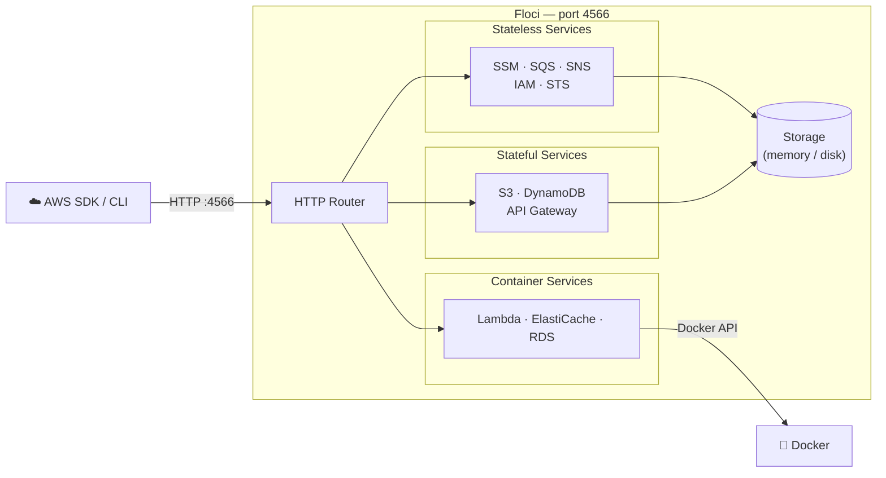
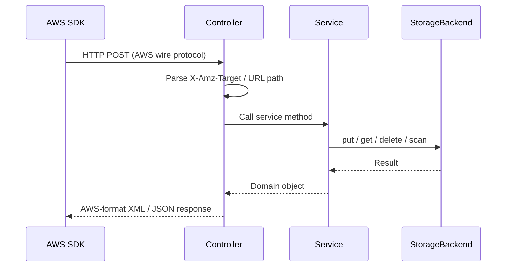
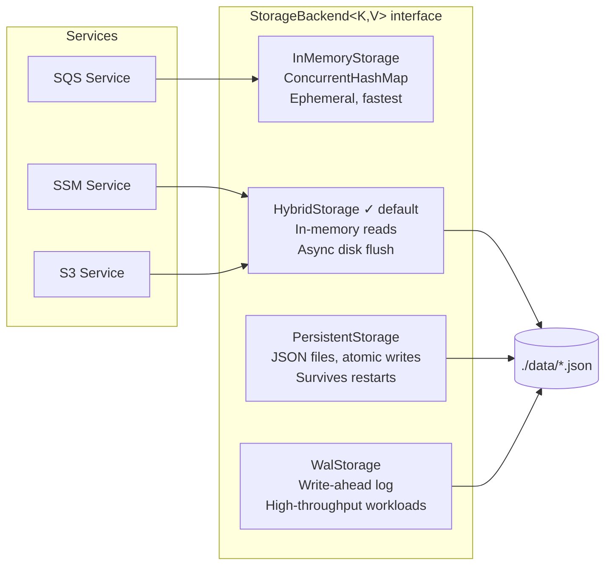
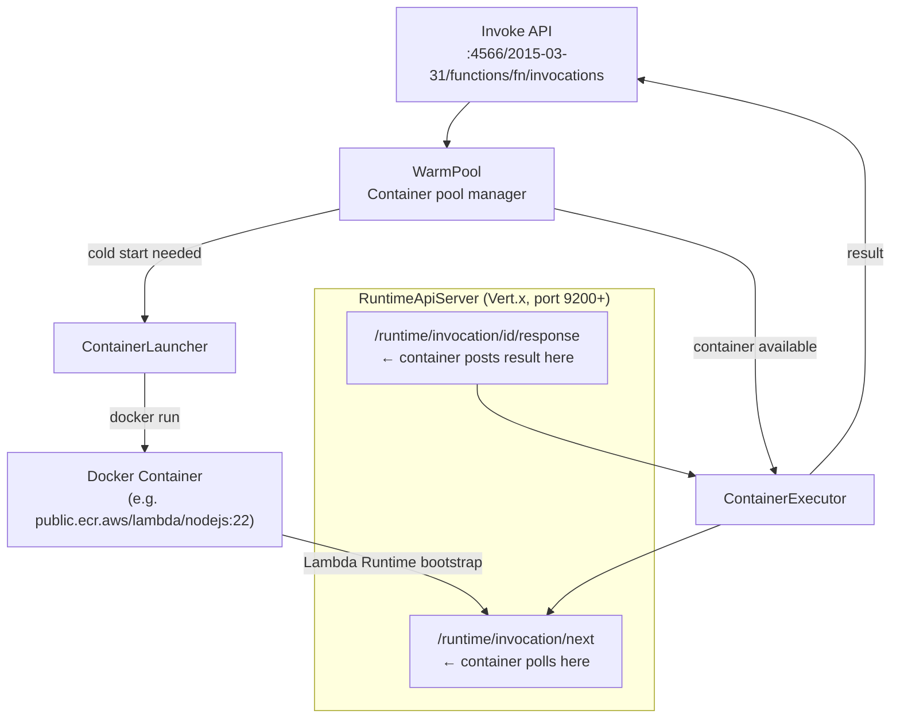
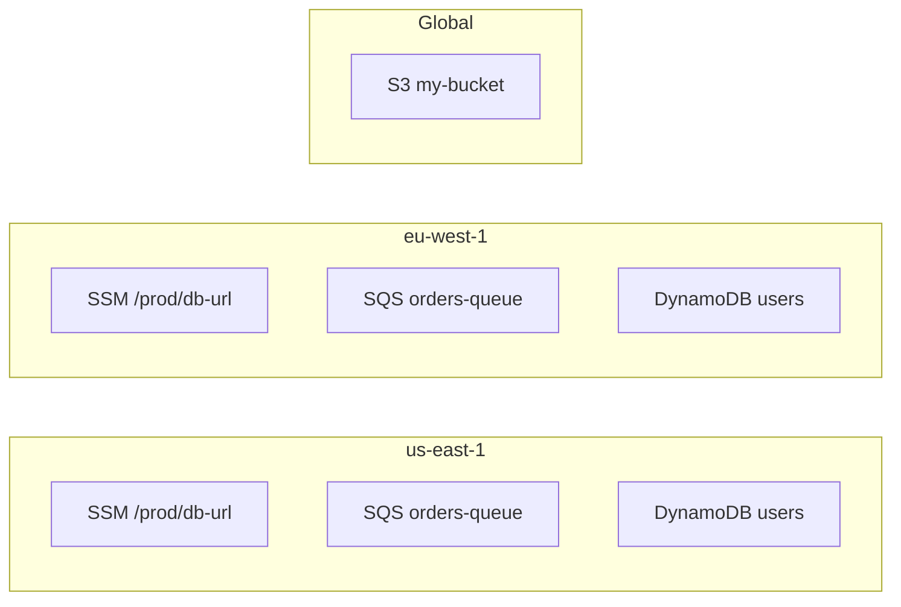

Local development against AWS services has always been painful. You either run real AWS (expensive,
slow, requires an internet connection) or use an emulator. For years, **LocalStack** was the
go-to choice — until they required auth tokens and locked down their community edition in early 2026.

That gap is exactly what **Floci** fills.

## What Is Floci?

**Floci** is a free, open-source local AWS service emulator written in Java using
[Quarkus](https://quarkus.io/) and compiled to a native binary via GraalVM Mandrel. It runs as a
single process on port `4566` — the same port LocalStack uses — so switching requires zero changes
to your existing code or tooling.

The name comes from *cirrocumulus floccus* (abbreviated *floci*), a cloud formation that looks like
popcorn — small, fluffy, and lightweight. That ethos drives the entire design: minimal footprint,
fast startup, and no unnecessary overhead.

```
Startup time:  19 ms  (native) / 771 ms (JVM)
Idle memory:   42 MiB (native) / 96 MiB (JVM)
License:       MIT
Auth required: Never
```

---

## Architecture Overview

Floci follows a clean three-layer architecture for every AWS service it emulates:



### Request Flow

Every AWS request goes through the same pipeline:



---

## Supported AWS Services

Floci covers 11 major AWS service families out of the box:

| Service | Operations | Notable Features |
|---|---|---|
| **SSM Parameter Store** | 7 | PutParameter, GetParametersByPath, version history |
| **SQS** | 10 | Standard & FIFO, DLQ, visibility timeout, message attributes |
| **S3** | 17 | Versioning, multipart upload, pre-signed URLs, tagging, event notifications |
| **DynamoDB** | 10 | Query, Scan, UpdateItem with expression support |
| **Lambda** | Full | Docker container execution, warm pool, SQS/SNS triggers, all runtimes |
| **API Gateway** | REST v1 | Resources, methods, stages, Lambda proxy, MOCK integrations |
| **SNS** | Full | Topics, subscriptions, SQS/Lambda/HTTP/Email delivery |
| **IAM** | Core | Users, roles, groups, access keys, policies |
| **STS** | Core | AssumeRole, GetCallerIdentity |
| **ElastiCache** | Replication groups | Redis/Valkey via Docker, auth proxy, SigV4 validation |
| **RDS** | DB instances & clusters | MySQL, PostgreSQL, MariaDB via Docker, auth proxy |

---

## Storage Architecture

One of Floci's most flexible design decisions is its pluggable storage layer. Every service gets its
own backend, and backends are configurable per service.



The default **HybridStorage** gives you the best of both worlds: in-memory read speed with
background persistence so your data survives container restarts.

---

## Lambda Execution Architecture

Lambda is the most complex service in Floci. Functions run inside **real Docker containers**, not
a JavaScript VM or mock interpreter. This means your Node.js, Python, Java, Go, or Ruby functions
run exactly as they would in production.



When an invocation arrives:

1. The **WarmPool** checks if a pre-warmed container exists for the function
2. If not, **ContainerLauncher** pulls the runtime image and starts a container
3. The container's Lambda bootstrap polls `/runtime/invocation/next` on the embedded **RuntimeApiServer**
4. The invocation payload is delivered, the function executes, and the result is posted back
5. The container is returned to the warm pool for reuse

---

## Floci vs LocalStack

### Feature Comparison

| Feature | Floci | LocalStack Community |
|---|---|---|
| **Price** | Free forever | Requires auth token (since March 2026) |
| **CI/CD usage** | Unlimited | Requires paid plan |
| **License** | MIT | Restricted / proprietary |
| **Auth token required** | Never | Yes |
| **Security updates** | Yes | Frozen for community tier |
| **Native binary** | Yes (~47 MB) | No |
| **Docker required for Lambda** | Yes | Yes |
| **SSM Parameter Store** | ✅ Full | ✅ Full |
| **SQS** | ✅ Full | ✅ Full |
| **S3** | ✅ Full | ✅ Full |
| **DynamoDB** | ✅ Full | ✅ Full |
| **Lambda** | ✅ Full | ⚠️ Limited in community |
| **API Gateway** | ✅ Full | ⚠️ Limited in community |
| **SNS** | ✅ Full | ✅ Full |
| **ElastiCache** | ✅ Docker-native | ❌ Pro only |
| **RDS** | ✅ Docker-native | ❌ Pro only |
| **SQS → Lambda trigger** | ✅ | ❌ Fails in community |

### AWS SDK Compatibility Test Results

Floci was benchmarked against LocalStack 4.14.0 using a suite of 166 AWS SDK v2 checks:

| Category | Checks | Floci | LocalStack |
|---|---|---|---|
| SQS | 15 | ✅ 15/15 | ✅ 15/15 |
| SQS → Lambda ESM | 13 | ✅ 13/13 | ❌ 0/13 |
| S3 | 23 | ✅ 23/23 | ⚠️ 22/23 |
| SSM | 12 | ✅ 12/12 | ✅ 12/12 |
| DynamoDB | 18 | ✅ 18/18 | ✅ 18/18 |
| Lambda CRUD | 10 | ✅ 10/10 | ✅ 10/10 |
| Lambda Invoke | 4 | ✅ 4/4 | ✅ 4/4 |
| Lambda HTTP | 8 | ✅ 8/8 | ✅ 8/8 |
| Lambda Warm Pool | 3 | ✅ 3/3 | ✅ 3/3 |
| Lambda Concurrent | 3 | ✅ 3/3 | ❌ 0/3 |
| API Gateway | 34 | ✅ 34/34 | ⚠️ 17/34 |
| API Gateway Execute | 11 | ✅ 11/11 | ⚠️ 6/11 |
| S3 Event Notifications | 11 | ✅ 11/11 | ⚠️ 8/11 |
| **Total** | **166** | **✅ 166/166 (100%)** | **⚠️ 140/166 (84%)** |

---

## Performance Benchmarks

### JVM vs Native Binary

| Metric | JVM | Native | Improvement |
|---|---|---|---|
| Startup time | 771 ms | **19 ms** | 40× faster |
| Idle memory | 96 MiB | **42 MiB** | 56% less |
| Memory under load | 233 MiB | **67 MiB** | 71% less |
| Lambda cold start | 1,127 ms | **582 ms** | 1.9× faster |
| Lambda warm avg latency | 4 ms | **2 ms** | 2× faster |
| Throughput (10k invocations) | 281 req/s | 288 req/s | ~equivalent |

### Floci Native vs LocalStack Community

| Metric | Floci Native | LocalStack 4.14.0 | Floci Advantage |
|---|---|---|---|
| Startup time | **19 ms** | ~11,000 ms | **550× faster** |
| Idle memory | **42 MiB** | ~500 MiB | **92% less** |
| Lambda warm latency | **2 ms avg** | 26 ms avg | **13× faster** |
| Lambda throughput | **287 req/s** | 116 req/s | **2.5× faster** |

---

## Quick Start

### Docker (one command)

```bash
docker run --rm -p 4566:4566 hectorvent/floci:native
```

Or use the JVM image:

```bash
docker run --rm -p 4566:4566 hectorvent/floci:latest
```

### docker-compose (with Lambda + ElastiCache + RDS)

```yaml
services:
  floci:
    image: hectorvent/floci:native
    ports:
      - "4566:4566"
      - "6379-6399:6379-6399"   # ElastiCache proxies
      - "7000-7099:7000-7099"   # RDS proxies
    volumes:
      - /var/run/docker.sock:/var/run/docker.sock
      - ./data:/data
    environment:
      EMULATOR_STORAGE_MODE: hybrid
      EMULATOR_STORAGE_PERSISTENT_PATH: /data
      EMULATOR_SERVICES_ELASTICACHE_DOCKER_NETWORK: myapp_default
      EMULATOR_SERVICES_RDS_DOCKER_NETWORK: myapp_default
```

### Configure your AWS SDK

Point any AWS SDK to Floci by setting the endpoint URL and dummy credentials:

```bash
# AWS CLI
aws --endpoint-url http://localhost:4566 s3 mb s3://my-bucket
aws --endpoint-url http://localhost:4566 sqs create-queue --queue-name my-queue

# Environment variables (for SDK auto-discovery)
export AWS_ENDPOINT_URL=http://localhost:4566
export AWS_ACCESS_KEY_ID=test
export AWS_SECRET_ACCESS_KEY=test
export AWS_DEFAULT_REGION=us-east-1
```

```java
// Java SDK v2
S3Client s3 = S3Client.builder()
    .endpointOverride(URI.create("http://localhost:4566"))
    .region(Region.US_EAST_1)
    .credentialsProvider(StaticCredentialsProvider.create(
        AwsBasicCredentials.create("test", "test")))
    .build();
```

### Build from source

```bash
git clone https://github.com/hectorvent/floci
cd floci

# JVM build
mvn clean package -DskipTests
java -jar target/quarkus-app/quarkus-run.jar

# Native binary (requires GraalVM / Mandrel)
mvn clean package -Dnative -DskipTests
./target/floci-runner

# Dev mode with hot reload
mvn quarkus:dev
```

---

## Region Isolation

Floci isolates resources by AWS region out of the box. SSM parameters, SQS queues, DynamoDB tables,
and Lambda functions created in `us-east-1` are completely independent from those in `eu-west-1`.
S3 buckets follow AWS's global bucket namespace model.



---

## Why Not Just Use Mocks?

Unit-level mocks are fast but brittle — they test your code, not your integration with AWS. Floci
lets you run real AWS SDK calls, real IAM policies, real event-source mappings (SQS → Lambda), and
real API Gateway routing, all locally. When your CI environment runs the exact same stack as
production, "it works on my machine" becomes "it works, period."

---

## What's Next

Floci is actively developed. Upcoming work includes expanding Lambda event source mappings
(Kinesis, DynamoDB Streams), CloudFormation stack support, and CloudWatch Logs. Contributions are
welcome at [github.com/hectorvent/floci](https://github.com/hectorvent/floci).

---

*Floci is MIT-licensed. No auth tokens. No usage limits. No surprises.*
