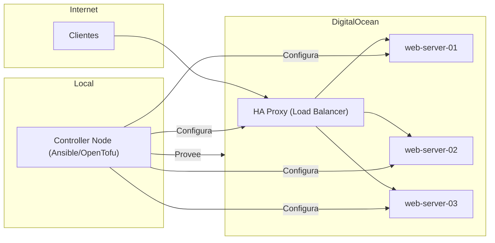

*Charla y taller presentado en [JConf Dominicana](https://jconfdominicana.org/) — Julio 2024*

---

## ¿Qué es IaC?

La **Infraestructura como Código (IaC)** es una práctica fundamental en DevOps y administración de sistemas modernos. Consiste en gestionar y aprovisionar la infraestructura mediante archivos de configuración legibles por humanos, en lugar de realizar configuraciones manuales a través de interfaces gráficas.

### Beneficios clave:
- **Versionamiento de código:** Almacena tu infraestructura en Git.
- **Replicabilidad:** Crea entornos idénticos (Dev, QA, Prod) de forma consistente.
- **Velocidad:** Despliega servidores y redes en segundos.
- **Reducción de costos:** Evita errores humanos y recursos olvidados.

---

## ¿Por qué "para todos"?

A menudo se piensa que la IaC es solo para grandes arquitecturas de nube. Sin embargo, los principios de automatización son útiles en cualquier nivel: desde la instalación de un servidor personal hasta el despliegue de clusters complejos. Si tienes que instalar, configurar o hacer backup de algo más de una vez, deberías usar IaC.

---

## El Taller: De lo Manual a lo Automatizado

En este taller recorrimos la evolución de la infraestructura a través de 7 módulos prácticos, utilizando **DigitalOcean** como nuestro proveedor de nube.

### Requerimientos base:
- Cuenta en Digital Ocean.
- Java 21.
- Maven.
- Docker.

---

### Módulo 1: La forma manual (Control Panel)

Comenzamos explorando cómo crear un Droplet (servidor) de la forma tradicional, eligiendo región, imagen (Debian 12) y tamaño manualmente para entender lo que luego automatizaríamos.

---

### Módulo 2: Automatización por CLI con `doctl`

El primer paso hacia la automatización es el uso de la línea de comandos. `doctl` es el cliente oficial de DigitalOcean que permite interactuar con su API.

```bash
doctl compute droplet create 
  --image debian-12-x64 
  --size s-1vcpu-512mb-10gb 
  --region nyc1 
  --enable-monitoring 
  iac-everyone-server-1
```

---

### Módulo 3: Infraestructura Declarativa con OpenTofu

[OpenTofu](https://opentofu.org/) (el fork open-source de Terraform) nos permite definir recursos de forma declarativa en archivos `.tf`.

```hcl
resource "digitalocean_droplet" "iac-everyone-server-1" {
  image  = "debian-12-x64"
  name   = "iac-everyone-server-1"
  region = "nyc1"
  size   = "s-1vcpu-512mb-10gb"
  ssh_keys = [
    data.digitalocean_ssh_key.my_key.id
  ]
}
```

---

### Módulo 4: IaC con Lenguajes de Programación (Pulumi)

[Pulumi](https://www.pulumi.com/) permite gestionar la infraestructura utilizando lenguajes convencionales como Java, JavaScript o Python, facilitando la integración con lógica de negocio y pruebas unitarias.

```java
Pulumi.run(ctx -> {
    var web = new Droplet("web", DropletArgs.builder()
        .image("debian-12-x64")
        .name("iac-everyone-server-1")
        .region("nyc1")
        .size("s-1vcpu-512mb-10gb")
        .build());
});
```

---

### Módulo 5: Configuración con Ansible

Mientras OpenTofu/Pulumi crean el "hardware" virtual, **Ansible** se encarga de lo que corre dentro (Configuración). Es una herramienta sin agentes que utiliza YAML para definir tareas.

```yaml
- name: Configurando el cluster web
  hosts: web-server
  tasks:
    - name: Instalando nginx
      apt:
        update_cache: yes
        pkg:
          - nginx
          - postgres
          - redis
```

---

## Proyecto Final: Caso Real

El taller culminó con un despliegue completo de una arquitectura balanceada:
1. **OpenTofu** para crear 3 servidores web y un Load Balancer.
2. **Ansible** para instalar Nginx en los servidores y configurar el HAProxy en el balanceador.



---

## Conclusión

La infraestructura como código no es solo una herramienta, es una mentalidad de **automatización primero**. Ya sea que uses CLI, DSLs o lenguajes de programación, el objetivo es el mismo: infraestructura confiable, repetible y documentada.

---

### Recursos
- [Presentación completa (PDF)](/temp/JConf%20Dominicana%20-%20IaC%20para%20todos.pdf)
- [DigitalOcean doctl](https://github.com/digitalocean/doctl)
- [OpenTofu](https://opentofu.org/)
- [Pulumi](https://www.pulumi.com/)
- [Ansible](https://www.ansible.com/)
