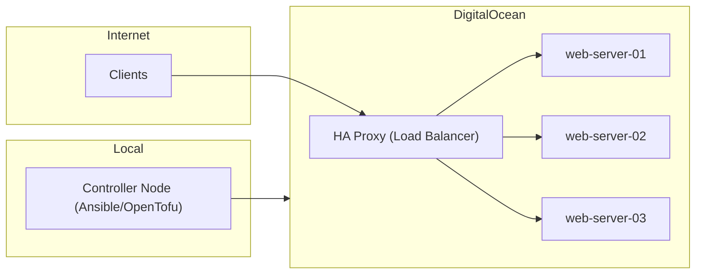

*Talk and workshop presented at [JConf Dominicana](https://jconfdominicana.org/) — July 2024*

---

## What is IaC?

**Infrastructure as Code (IaC)** is a fundamental practice in DevOps and modern system administration. It involves managing and provisioning infrastructure through human-readable configuration files, rather than through manual processes or graphical interfaces.

### Key Benefits:
- **Code Versioning:** Store your infrastructure in Git.
- **Replicability:** Create identical environments (Dev, QA, Prod) consistently.
- **Speed:** Deploy servers and networks in seconds.
- **Cost Reduction:** Avoid human errors and forgotten/zombie resources.

---

## Why "for everyone"?

IaC is often thought to be exclusively for large cloud architectures. However, automation principles are useful at any scale: from setting up a personal server to deploying complex clusters. If you have to install, configure, or back up something more than once, you should be using IaC.

---

## The Workshop: From Manual to Automated

In this workshop, we went through the evolution of infrastructure across 7 practical modules, using **DigitalOcean** as our cloud provider.

### Base Requirements:
- DigitalOcean Account.
- Java 21.
- Maven.
- Docker.

---

### Module 1: The Manual Way (Control Panel)

We started by exploring how to create a Droplet (server) the traditional way, manually choosing the region, image (Debian 12), and size to understand what we would automate later.

---

### Module 2: CLI Automation with `doctl`

The first step towards automation is using the command line. `doctl` is the official DigitalOcean client that allows interaction with their API.

```bash
doctl compute droplet create \
  --image debian-12-x64 \
  --size s-1vcpu-512mb-10gb \
  --region nyc1 \
  --enable-monitoring \
  iac-everyone-server-1
```

---

### Module 3: Declarative Infrastructure with OpenTofu

[OpenTofu](https://opentofu.org/) (the open-source fork of Terraform) allows us to define resources declaratively in `.tf` files.

```hcl
resource "digitalocean_droplet" "iac-everyone-server-1" {
  image  = "debian-12-x64"
  name   = "iac-everyone-server-1"
  region = "nyc1"
  size   = "s-1vcpu-512mb-10gb"
  ssh_keys = [
    data.digitalocean_ssh_key.my_key.id
  ]
}
```

---

### Module 4: IaC with Programming Languages (Pulumi)

[Pulumi](https://www.pulumi.com/) allows managing infrastructure using conventional languages like Java, JavaScript, or Python, making it easier to integrate with business logic and unit testing.

```java
Pulumi.run(ctx -> {
    var web = new Droplet("web", DropletArgs.builder()
        .image("debian-12-x64")
        .name("iac-everyone-server-1")
        .region("nyc1")
        .size("s-1vcpu-512mb-10gb")
        .build());
});
```

---

### Module 5: Configuration with Ansible

While OpenTofu/Pulumi create the virtual "hardware", **Ansible** takes care of what runs inside (Configuration). It is an agentless tool that uses YAML to define tasks.

```yaml
- name: Configuring the web cluster
  hosts: web-server
  tasks:
    - name: Installing nginx
      apt:
        update_cache: yes
        pkg:
          - nginx
          - postgres
          - redis
```

---

## Final Project: Real Case

The workshop culminated with a complete deployment of a balanced architecture:
1. **OpenTofu** to create 3 web servers and a Load Balancer.
2. **Ansible** to install Nginx on the servers and configure HAProxy on the load balancer.



---

## Conclusion

Infrastructure as code is not just a tool; it's an **automation-first** mindset. Whether you use CLI, DSLs, or programming languages, the goal remains the same: reliable, repeatable, and documented infrastructure.

---

### Resources
- [Full Presentation (PDF)](/temp/JConf%20Dominicana%20-%20IaC%20para%20todos.pdf)
- [DigitalOcean doctl](https://github.com/digitalocean/doctl)
- [OpenTofu](https://opentofu.org/)
- [Pulumi](https://www.pulumi.com/)
- [Ansible](https://www.ansible.com/)
