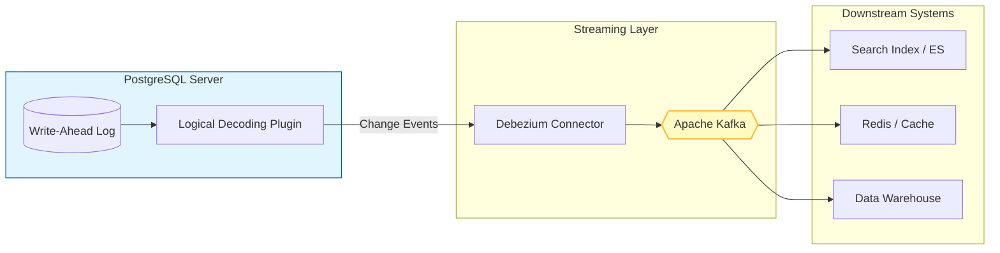

*Upcoming talk at [Postgres MetroPlex Dallas](https://www.meetup.com/dallas-fort-worth-postgres/) — April 2026*

---

## What is CDC?

**Change Data Capture (CDC)** is a set of software design patterns used to determine and track the data that has changed so that action can be taken using the changed data. 

Instead of traditional polling (which is slow and adds load to the database), CDC allows us to stream every `INSERT`, `UPDATE`, and `DELETE` as it happens, with sub-second latency.

---

## Why Debezium?

[Debezium](https://debezium.io/) is an open-source distributed platform for change data capture. It points at your databases, and your applications can start responding to all of the row-level changes other applications make to your databases. 

Debezium is built on top of **Apache Kafka** and provides connectors for several databases, with PostgreSQL being one of the most robust.

### Key Advantages:
- **Low Latency:** Changes are captured almost instantly.
- **No Schema Changes:** You don't need to add `updated_at` columns or triggers to your tables.
- **Reliability:** Captures every change, even those that happen while your application is down.

---

## How it Works with Postgres

PostgreSQL uses a mechanism called **Logical Decoding** to extract changes from the Write-Ahead Log (WAL). Debezium hooks into this log using a logical decoding plugin (like `pgoutput`), converts the binary log into a structured format (JSON or Avro), and pushes it to Kafka.

### Data Flow Diagram

---

## What We'll Cover in the Talk

In the upcoming presentation at Postgres MetroPlex Dallas, we will dive deep into:
1.  **Configuring PostgreSQL** for logical replication.
2.  **Setting up Debezium** using Docker and Kafka Connect.
3.  **Handling Schema Evolutions** without breaking downstream consumers.
4.  **Real-world Use Cases:** Cache invalidation, building search indexes, and microservices synchronization.

Stay tuned for more details and the full presentation slides after the event!

---

### Resources
- [Postgres MetroPlex Dallas Meetup](https://www.meetup.com/dallas-fort-worth-postgres/)
- [Debezium Official Documentation](https://debezium.io/documentation/)
- [PostgreSQL Logical Replication](https://www.postgresql.org/docs/current/logical-replication.html)
