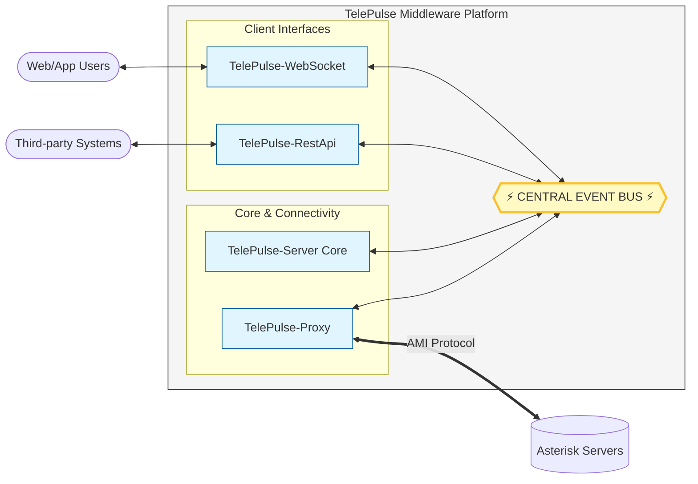

## Overview

The **TelePulse Platform** was conceived and developed as a robust, viable alternative to the FOP2 (Flash Operator Panel 2) system for a telecommunications client. The primary goal was to address the weaknesses of their existing setup, particularly concerning performance bottlenecks and the slow support turnaround times they were experiencing.

By architecting a custom solution, we were able to deliver a system tailored to their specific load requirements, offering real-time interactions and a highly modular design that guarantees future scalability and ease of maintenance.

---

## Architecture and Modular Design

The core philosophy behind the TelePulse Platform is modularity. The system is broken down into distinct, specialized modules that communicate with each other exclusively through an **Event Bus**. This design ensures that each module operates independently, meaning new features or integrations (Plugins) can be added without altering the existing, stable codebase.

### System Architecture Diagram

---

## Core Modules

### 1. TelePulse-Proxy

This is the gateway to the telephony infrastructure. The Proxy module is solely responsible for managing connections to multiple Asterisk servers via the **Asterisk Manager Interface (AMI)**. 

**Key Responsibilities:**
- Maintains and persists connections to `N` number of Asterisk servers.
- Captures actions, events, and responses from Asterisk.
- Modifies payloads to inject a `ServerId`, ensuring the platform knows exactly which server emitted an event or where an action should be routed.
- Publishes these events to the Event Bus for other modules to consume.
- **Hot-Swapping:** Features an HTTP API (default port 8082) that allows adding or removing Asterisk servers on the fly, without needing to restart the application.

### 2. TelePulse-Server (Core)

The brain of the platform. The Core listens to the Event Bus for raw events emitted by the Proxy and translates them into the "TelePulse language". 

For example, an AMI `Originate` action is translated into a much simpler TelePulse `dial` command. This abstraction layer shields the rest of the application (like frontends or external APIs) from the complexities and syntax of the AMI protocol.

### 3. TelePulse-WebSocket

This module implements a WebSocket server (default port 8084), providing the crucial real-time interface required by modern web applications. It allows web browsers and other WebSocket clients to interact instantly with the platform, receiving live updates on extension statuses, active calls, and user availability.

### 4. TelePulse-RestApi

Exposes a standard HTTP interface for executing actions within the platform, allowing for easy integration with third-party systems, CRMs, or traditional HTTP clients.

---

## The Event Bus and Communication

All internal communication relies on specific addresses within the Event Bus.

- `telepulse.proxy.status` *(Read Only)*: Broadcasts changes in server connection states (CONNECTED, DISCONNECTED, etc.).
- `telepulse.proxy.event` *(Read Only)*: Routes all events (Responses or Events) from connected Asterisk servers, standardized into JSON with an appended `ServerId`.
- `telepulse.proxy.action` *(Write Only)*: The endpoint where the Core sends translated commands (like `Originate`, `Transfer`, `Hangup`) to be executed by the Proxy on a specific Asterisk server.
- `telepulse.proxy.command` *(Write)*: Used for administrative tasks like restarting, stopping, or listing connections.

---

## Real-Time Capabilities

Through the WebSocket module, the platform supports a wide array of real-time actions and events, crucial for call center operations:

- **Actions:** `dial`, `hangup`, `transfer`, `spy` (listening in), `whisper` (coaching), and `record`.
- **Events:** `userStatus` (online/offline), `activeUsers`, `activeLines` (detailed state of calls including ring, hold, music-on-hold, recording status), and general `channelState` changes.

## Conclusion

The TelePulse Platform successfully modernized the client's telephony interface. By decoupling the Asterisk connection management (Proxy) from the business logic (Core) and the client interfaces (WebSocket/API), we delivered a system that is not only faster and more reliable than their legacy FOP2 setup but also primed for future custom integrations.
